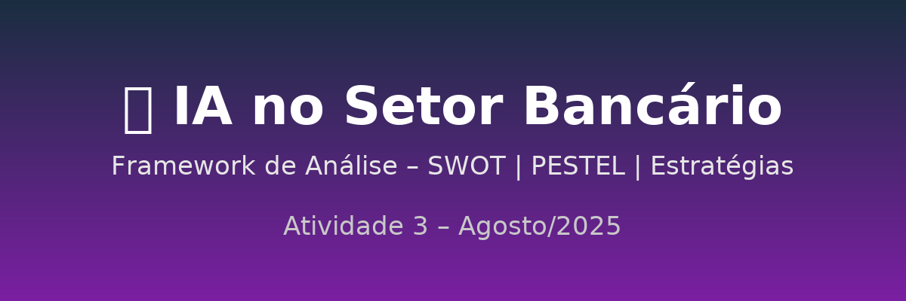

# 📊  Análise - IA no Setor Bancário

## 🔎 1. SWOT – Forças, Fraquezas, Oportunidades e Ameaças

**Forças (Strengths)**
- Automação de processos → maior eficiência e redução de custos.
- Personalização de produtos financeiros via IA.
- Prevenção de fraudes e análise preditiva de riscos.
- Parcerias com fintechs para acelerar inovação.

**Fraquezas (Weaknesses)**
- Falta de transparência dos algoritmos (black boxes).
- Dependência tecnológica crescente → vulnerabilidade a falhas.
- Resistência interna de funcionários não capacitados.
- Exclusão digital de clientes menos familiarizados com tecnologia.

**Oportunidades (Opportunities)**
- Novos modelos de negócio (serviços hiperpersonalizados).
- Uso de IA em compliance e auditoria → governança mais robusta.
- Expansão do acesso a serviços financeiros para populações não atendidas.
- Crescimento de ecossistemas colaborativos (bancos + fintechs + reguladores).

**Ameaças (Threats)**
- Ataques cibernéticos cada vez mais sofisticados.
- Risco de vieses algorítmicos prejudicando clientes.
- Impactos sociais no emprego bancário (substituição de funções).
- Regulação lenta e assimétrica em diferentes países.

---

## 🌍 2. PESTEL – Fatores externos que moldam a adoção da IA
- **Político** → Regulação ainda em construção (Banco Central no Brasil; AI Act na União Europeia).
- **Econômico** → Investimentos bilionários em IA, mas com risco de retorno desigual.
- **Social** → Inclusão digital como desafio; impacto no emprego e confiança do consumidor.
- **Tecnológico** → Avanços em machine learning, big data e IA generativa, mas com riscos de segurança.
- **Ecológico** → Alto consumo energético de sistemas de IA em larga escala.
- **Legal** → Necessidade de garantir conformidade, transparência e auditabilidade dos modelos.

---

## 🧭 3. Estratégias Recomendadas (Framework de Ação)

**Curto prazo**
- Capacitar colaboradores para uso da IA.
- Implantar mecanismos de auditoria e monitoramento de algoritmos.
- Fortalecer cibersegurança e resposta a incidentes.

**Médio prazo**
- Criar comitês de governança de IA para supervisionar ética e transparência.
- Usar IA para compliance regulatório e automação de controles internos.
- Estabelecer parcerias estratégicas com fintechs para acelerar inovação.

**Longo prazo**
- Desenvolver estratégias de inclusão digital para evitar exclusão de clientes.
- Redesenhar o mercado de trabalho interno: foco em requalificação ao invés de substituição.
- Atuar junto a reguladores para co-construir normas que equilibrem inovação e segurança.

---

## ⚖️ Questões Éticas – Tabela Resumida

| **Questão Ética**         | **Situação Atual**                                                   | **Riscos Identificados**                                                       | **Boas Práticas / Ethical AI by Design**                                                                  |
|----------------------------|-----------------------------------------------------------------------|-------------------------------------------------------------------------------|-----------------------------------------------------------------------------------------------------------|
| **Viés e Justiça**         | Algoritmos de crédito e risco treinados com dados históricos.        | Reforço de preconceitos → exclusão de grupos de baixa renda, idosos, minorias. | Auditoria de viés nos dados, uso de bases diversas, políticas de não discriminação.                       |
| **Transparência**          | Modelos funcionam como *black boxes* (difícil explicação).           | Decisões financeiras opacas → cliente não entende por que teve crédito negado. | Implementar **Explainable AI (XAI)**, relatórios claros de critérios de decisão, direito à contestação.   |
| **Impacto Social**         | Substituição de funções operacionais por IA (crédito, atendimento).  | Desemprego estrutural, exclusão digital de quem não domina tecnologia.         | Requalificação profissional, criação de funções de supervisão humana, estratégias de inclusão digital.    |
| **Direitos Fundamentais**  | Uso de dados sensíveis (histórico financeiro, localização, consumo). | Risco de violação da **LGPD**, vazamento de dados e decisões discriminatórias. | Compliance com LGPD, anonimização de dados, consentimento informado, auditoria de privacidade.            |
| **Governança**             | Regulação ainda em debate (Brasil e exterior).                       | Lacunas regulatórias → exploração de falhas éticas ou legais.                  | Comitês de ética em IA, governança algorítmica, cooperação com reguladores (Banco Central, UE, G7, OCDE). |
| **Responsabilidade**       | Falta de accountability clara em falhas ou injustiças algorítmicas.  | Clientes prejudicados sem saber quem responsabilizar.                          | Definição de responsabilidades, canais de contestação, auditoria contínua de decisões automatizadas.      |

---

## ✅ Conclusão do Framework
O artigo mostra que a IA nos bancos é uma arma de dois gumes: pode trazer ganhos gigantes de eficiência, personalização e segurança, mas também riscos elevados de exclusão, falta de transparência e vulnerabilidade.  
O futuro competitivo das instituições dependerá de como conseguirem equilibrar inovação tecnológica com governança ética, regulatória e social.

---

🔗 **Referência**:  
[Estadão – Bancos e Inteligência Artificial: Quem está no controle?](https://www.estadao.com.br/economia/gestao-e-negocios/bancos-e-inteligencia-artificial-quem-esta-no-controle/?srsltid=AfmBOori52THAPwIOh1Uf3WXeOlOapM3CGFw3OT6kVxTpYHwKyBoC87G)

---

  **Atividade Acadêmica**  
👩‍💻  
